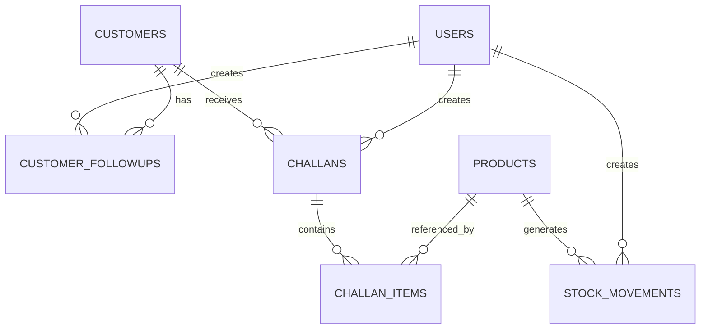

# NexLedger

> Connected operations. Smarter business.

**Internal B2B ERP / CRM / Inventory platform for wholesale and distribution businesses.**


> ⚠️ **Documentation note:** This README was generated from the NexLedger product specification and an entity-relationship diagram only. No source repository (code, `package.json`, migrations, routes, or tests) was available for inspection at the time of writing. Every claim below is labeled **Verified** (confirmed from the ER diagram/spec) or **Not verified** (described in the spec but not confirmed against actual code). Replace the "Not verified" items once the repository is inspected — see [Section 20: How to Finish This README](#20-how-to-finish-this-readme).

---

## Table of Contents

1. [Overview](#1-overview)
2. [Problem Statement](#2-problem-statement)
3. [Core Roles](#3-core-roles)
4. [Core Business Workflow](#4-core-business-workflow)
5. [Database Schema](#5-database-schema)
6. [Entity Relationship Diagram](#6-entity-relationship-diagram)
7. [Architecture](#7-architecture-not-verified)
8. [Technology Stack](#8-technology-stack)
9. [Authentication & RBAC](#9-authentication--rbac-not-verified)
10. [API](#10-api-not-verified)
11. [Local Development](#11-local-development-not-verified)
12. [Environment Variables](#12-environment-variables-not-verified)
13. [Testing](#13-testing-not-verified)
14. [Security](#14-security-not-verified)
15. [Known Limitations](#15-known-limitations)
16. [Future Roadmap](#16-future-roadmap)
17. [Project Status](#17-project-status)
18. [License](#18-license)
19. [Author](#19-author)
20. [How to Finish This README](#20-how-to-finish-this-readme)

---

## 1. Overview

NexLedger is a role-based business operations platform intended for wholesale and distribution workflows. Based on the entity relationships confirmed in the project's ER diagram, it centralizes **customers, products, inventory (via stock movements), and sales challans**, with **users** tied to the records they create.

*Not verified: exact product description, target market claims, and elevator pitch — these come from the specification document, not from inspected code, and should be confirmed against the actual repository README (if one exists) or product owner.*

## 2. Problem Statement

Wholesale/distribution businesses typically need to coordinate customers, sales, inventory, and stock movements across multiple people. Fragmented tooling can cause inconsistent stock counts, duplicate operations, and poor visibility into who changed what. NexLedger's schema (confirmed below) is structured around a single, centrally-tracked source of truth for stock and customer transactions.

## 3. Core Roles

*Not verified against actual authorization code — the ER diagram confirms a `USERS` table exists and is linked to `CHALLANS` and `STOCK_MOVEMENTS`, but does not confirm specific role names or permissions.*

The specification describes four intended roles:

| Role | Intended Purpose |
|---|---|
| Admin | Full system access |
| Sales | Customers, challans |
| Warehouse | Inventory, stock movements |
| Accounts | Read-only / financial visibility |

**Action needed:** confirm actual role values from the `users` table schema or auth middleware before publishing.

## 4. Core Business Workflow

**Verified relationships (from ER diagram):** a `USER` creates a `CHALLAN` for a `CUSTOMER`; a `CHALLAN` contains one or more `CHALLAN_ITEMS`; each `CHALLAN_ITEM` references a `PRODUCT`; `PRODUCTS` generate `STOCK_MOVEMENTS`, which are also attributed to the `USER` who created them.

```
CUSTOMER
   ↓
CHALLAN (created by USER)
   ↓
CHALLAN_ITEMS (reference PRODUCT)
   ↓
STOCK_MOVEMENTS (product + user)
```

*Not verified: the specific lifecycle states (e.g., DRAFT → CONFIRMED), transactional guarantees, row-locking, or concurrency handling described in the specification. These are architecturally plausible given the schema shape (challans separate from stock movements) but are **not confirmed** without reading the actual service/transaction code.*

## 5. Database Schema

**Verified tables (from ER diagram):**

| Table | Notes |
|---|---|
| `USERS` | Linked to `CUSTOMER_FOLLOWUPS`, `CHALLANS`, `STOCK_MOVEMENTS` as creator |
| `CUSTOMERS` | Linked to `CUSTOMER_FOLLOWUPS` and `CHALLANS` |
| `CUSTOMER_FOLLOWUPS` | Linked to both `USERS` and `CUSTOMERS` |
| `PRODUCTS` | Linked to `CHALLAN_ITEMS` and `STOCK_MOVEMENTS` |
| `CHALLANS` | Linked to `CUSTOMERS`, `USERS`, and `CHALLAN_ITEMS` |
| `CHALLAN_ITEMS` | Linked to `CHALLANS` and `PRODUCTS` |
| `STOCK_MOVEMENTS` | Linked to `PRODUCTS` and `USERS` |

*Not verified: column-level detail (field names, types, constraints), since the ER diagram only shows table names and relationships, not fields.*

## 6. Entity Relationship Diagram



This diagram is transcribed directly from the ER diagram you provided.

## 7. Architecture (Not verified)

The specification describes a layered backend:

```
Frontend → REST API → Express → Middleware → Controllers → Services → Repositories → PostgreSQL (Supabase)
```

This has **not** been confirmed against an actual `server/src` directory structure. Document this section only after inspecting the real codebase.

## 8. Technology Stack

| Layer | Technology | Status |
|---|---|---|
| Database | PostgreSQL | Not verified |
| DB Provider | Supabase | Not verified |
| Backend Runtime | Node.js | Not verified |
| API Framework | Express.js | Not verified |
| Language | TypeScript | Not verified |
| Auth | JWT | Not verified |
| Password Hashing | bcrypt | Not verified |
| Validation | Zod | Not verified |
| Frontend | Not documented | Not verified |

All entries above come from the specification document, not from inspected `package.json` dependencies. **Do not publish this table until confirmed.**

## 9. Authentication & RBAC (Not verified)

The specification describes JWT-based login with bcrypt password verification, and backend-enforced role checks (401 for unauthenticated, 403 for unauthorized). None of this is confirmed by the ER diagram, which only shows data relationships, not application logic. Confirm against actual middleware and route files.

## 10. API (Not verified)

No route files were available to inspect. Do not publish an endpoint table until one is generated directly from the actual Express routes.

## 11. Local Development (Not verified)

No `package.json` or setup scripts were available. Do not publish setup commands until confirmed against actual npm scripts.

## 12. Environment Variables (Not verified)

No `.env.example` was available. Do not publish an environment variable table until confirmed against actual configuration files. Never include real secret values.

## 13. Testing (Not verified)

**Test status: not verified.** No test files or test run output were available for inspection.

## 14. Security (Not verified)

The specification mentions JWT, bcrypt, Zod validation, parameterized SQL, RBAC, Helmet, CORS, and rate limiting. These are common, plausible choices for this stack but are **not confirmed** against actual dependencies or middleware.

## 15. Known Limitations

- This README itself is currently based on a specification and an ER diagram only — it has not been validated against the actual NexLedger codebase.
- Backend logic (transactions, concurrency handling, RBAC enforcement) is undocumented pending repository access.

## 16. Future Roadmap

*Planned, not implemented (per specification):*
- Advanced reporting
- PDF challan generation
- Refresh token rotation
- Audit logs
- Notifications
- Multi-warehouse support

## 17. Project Status

| Area | Status |
|---|---|
| Database schema | ✅ Verified (from ER diagram) |
| Business workflow (high level) | ✅ Verified (from ER diagram) |
| Authentication | ⚠️ Needs verification |
| RBAC | ⚠️ Needs verification |
| API | ⚠️ Needs verification |
| Testing | ⚠️ Needs verification |
| Deployment | ⚠️ Needs verification |

## 18. License

No license file was available for inspection. **No license has currently been specified.**

## 19. Author

Author information was not available for inspection. Not documented.

## 20. How to Finish This README

To turn this into the full, fact-checked README the original specification calls for, share one of the following and I'll complete the remaining sections against real evidence instead of the spec:

- A zip/archive of the repository
- A public GitHub repo URL
- The key files directly: `package.json`, routes, migrations/schema, `.env.example`, auth middleware, and any existing tests

Once I have those, I'll fill in Sections 7–14 (architecture, stack, auth, API, setup, env vars, testing, security) with verified details and remove the "Not verified" labels.