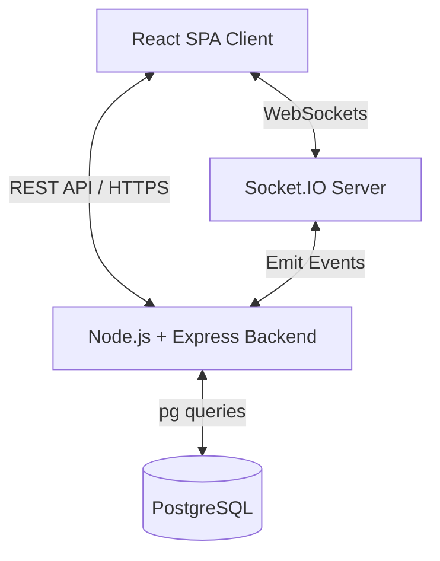
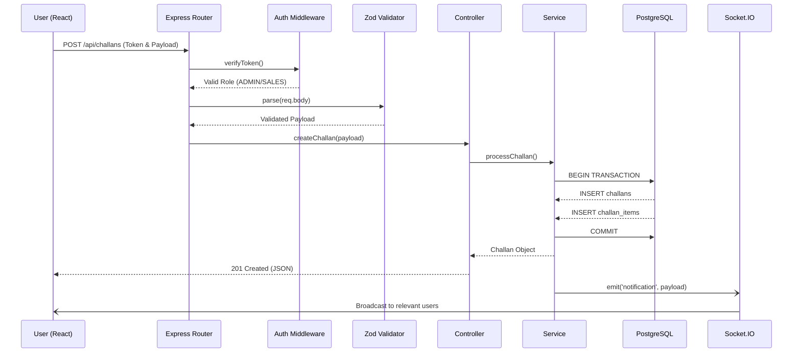

# System Architecture

NexLedger follows a decoupled, classic client-server model tailored for high performance and strict data integrity.

## High-Level Components

### 1. The Frontend (Client)
A Single Page Application (SPA) built with **React 19** and **Vite**. 
- **Routing**: Client-side routing managed by `react-router-dom`.
- **State Management**: Local UI state and authentication sessions are managed via `Zustand`. Remote server state (caching, polling, mutations) is handled heavily by `React Query`.
- **Styling**: Tailwind CSS combined with Radix UI headless primitives (via `shadcn/ui` patterns) for a highly accessible, rapid design system.

### 2. The Backend (Server)
A RESTful API built on **Express 5.2** running in a Node.js environment.
- **Controllers & Services**: The architecture heavily isolates business logic into `Services` and request handling into `Controllers`.
- **Validation layer**: Every incoming request body and parameter is strictly validated using `Zod` schemas before hitting controllers.
- **Real-Time Engine**: `Socket.IO` is attached to the main HTTP server to broadcast events asynchronously when critical mutations occur (e.g., when a challan is created).

### 3. The Database
A relational **PostgreSQL** database ensuring data integrity.
- **Raw SQL**: The application does not use an ORM (like Prisma or TypeORM). It relies on raw, optimized SQL queries using the `pg` driver, allowing maximum control over query plans (e.g., handling N+1 problems via `ANY($1)` array lookups).
- **Referential Integrity**: Robust use of Foreign Keys and Check Constraints (e.g., preventing stock from ever dropping below 0).

## Request / Response Flow

Below is an example of the standard request flow when a user attempts to create a new Challan.

## Real-Time Notification Architecture

The real-time notification engine acts as an asynchronous side-effect to the main business operations. This guarantees that **business operations never fail due to notification dispatch errors**.

- **Persistence**: Notifications are stored in the PostgreSQL `notifications` table for historical tracking.
- **Delivery**: Broadcasted via WebSockets using `Socket.IO`. 
- **Preferences**: Users configure `user_settings` (stored as JSONB) to control what topics (Challans, Inventory, Customers) they receive via sockets.
