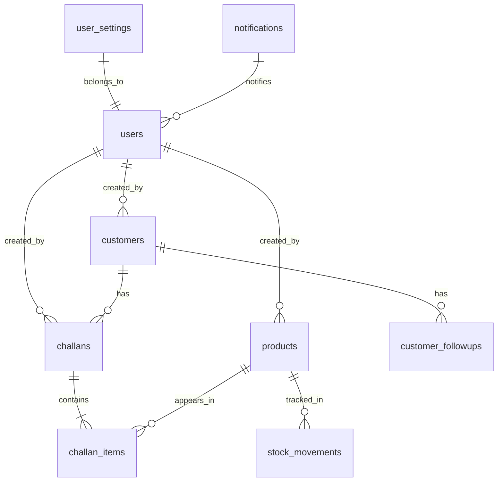

# PostgreSQL Database

NexLedger strictly relies on PostgreSQL for robust relational data mapping. The system does not use an ORM (like Prisma or TypeORM) but instead uses raw SQL via the `pg` driver to maximize query optimization and schema control.

## Schema Migrations

The database is built progressively using raw SQL migration files located in `server/migrations/`.

- **To run migrations:** `npm run db:migrate`
- **To seed the database:** `npm run db:seed`

## Core Tables and Constraints

### 1. `users`
Stores all employee accounts with role-based access.

| Column | Type | Constraints |
|---|---|---|
| `id` | `UUID` | Primary Key |
| `email` | `TEXT` | `UNIQUE`, `NOT NULL` |
| `password_hash` | `TEXT` | `NOT NULL` |
| `full_name` | `TEXT` | `NOT NULL` |
| `role` | `TEXT` | `CHECK (role IN ('ADMIN', 'SALES', 'WAREHOUSE', 'ACCOUNTS'))` |
| `is_active` | `BOOLEAN` | `DEFAULT true` |

### 2. `customers`
Stores client details. Includes a legacy data migration script in `003_create_customers.sql` which enforces contact resolution rules.

| Column | Type | Constraints |
|---|---|---|
| `business_name` | `TEXT` | `NOT NULL` |
| `contact_name` | `TEXT` | `NOT NULL` |
| `mobile` | `TEXT` | `NOT NULL` |
| `type` | `TEXT` | `CHECK (type IN ('RETAIL','WHOLESALE','DISTRIBUTOR'))` |
| `status` | `TEXT` | `CHECK (status IN ('LEAD','ACTIVE','INACTIVE'))` |
| `created_by` | `UUID` | `REFERENCES users(id) ON DELETE SET NULL` |

### 3. `products`
The main inventory catalog. **Constraint**: `current_stock` can never drop below `0`.

| Column | Type | Constraints |
|---|---|---|
| `sku` | `TEXT` | `UNIQUE`, `NOT NULL` |
| `name` | `TEXT` | `NOT NULL` |
| `unit_price` | `NUMERIC(12,2)` | `NOT NULL` |
| `current_stock` | `INTEGER` | `CHECK (current_stock >= 0)`, `DEFAULT 0` |
| `minimum_stock` | `INTEGER` | `DEFAULT 0` |

### 4. `challans` & `challan_items`
Manages B2B Sales Challans (Dispatch notes).
- A challan has a master record in `challans` and multiple row items in `challan_items`.
- `challan_items` stores *snapshots* of `product_name`, `sku`, and `unit_price` at the time of creation to prevent historical data corruption if a product's price is updated later.

### 5. `stock_movements`
The immutable ledger of all inventory IN/OUT actions.

| Column | Type | Constraints |
|---|---|---|
| `product_id` | `UUID` | `REFERENCES products(id)` |
| `type` | `TEXT` | `CHECK (type IN ('IN', 'OUT'))` |
| `quantity` | `INTEGER` | `CHECK (quantity > 0)` |
| `reference_type`| `TEXT` | `CHECK (reference_type IN ('MANUAL', 'CHALLAN'))` |

### 6. `notifications` & `user_settings`
Supports the real-time event broadcasting system.
- `notifications` stores the historical feed of alerts.
- `user_settings` stores the users opt-in preferences as a `JSONB` column to allow flexible configuration of alert types.

## Entity Relationship Diagram

## Concurrency & Transactions

When a Challan is `CONFIRMED`:
1. A database `BEGIN` transaction starts.
2. The `challans` status is updated to `CONFIRMED`.
3. The `products.current_stock` is decremented. If stock falls below zero, the `CHECK (current_stock >= 0)` constraint throws an error, rolling back the transaction.
4. `stock_movements` rows are inserted for each item.
5. The transaction is `COMMIT`ted.

This strict use of ACID properties ensures the inventory ledger can never fall out of sync with generated challans.
